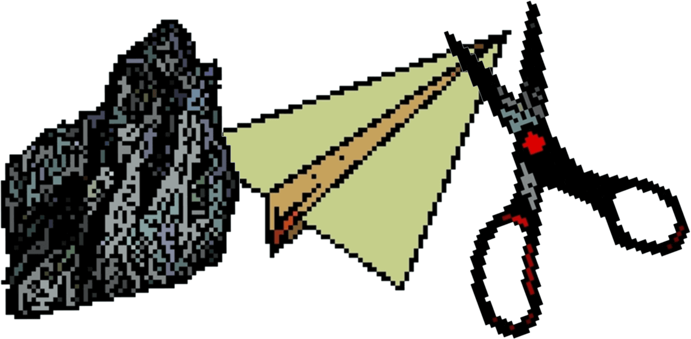
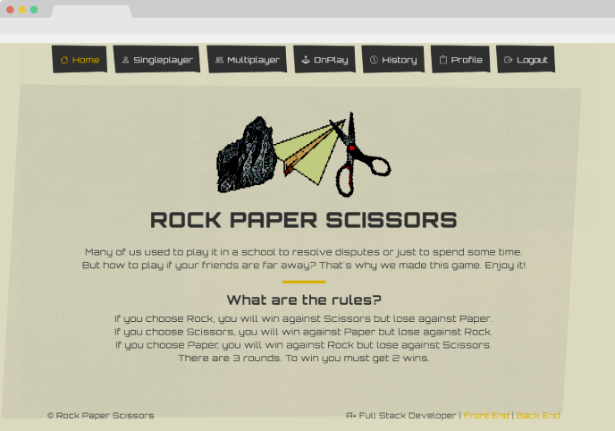

<div id="top"></div>

<!-- PROJECT LOGO -->
<br />
<div align="center">
  <a href="https://github.com/lopezrunco/Rock-Paper-Scissors-Front-End">
    
  </a>

<h3 align="center">Duit Rock-Paper-Scissors-Front-End</h3>

  <p align="center">
    Web app based in the classic Rock, paper & scissors game (MongoDB, Express, React & Node)
    <br />
    <a href='https://rpsgameaplus.netlify.app/single-player-start-screen'>View demo</a>
  </p>
</div>


<!-- TABLE OF CONTENTS -->
<details>
  <summary>Table of Contents</summary>
  <ol>
    <li>
      <a href="#about-the-project">About The Project</a>
      <ul>
        <li><a href="#built-with">Built With</a></li>
      </ul>
    </li>
    <li>
      <a href="#getting-started">Getting Started</a>
      <ul>
        <li><a href="#prerequisites">Prerequisites</a></li>
        <li><a href="#installation">Installation</a></li>
      </ul>
    </li>
    <li><a href="#contributing">Contributing</a></li>
  </ol>
</details>


<!-- ABOUT THE PROJECT -->
## About The Project



This game was created as a final project for a Full-Stack Development career. The guideline was to develop a responsive web application based on the MERN stack learned on classes while doing the necessary research. As part of the project, a wireframe of each screen along with a style library and the prototypes were designed. Also, every step of the research was documented.

You can expand the logic to define the winner of the game with more elements, just follow this logic in "id" and "losesTo":
```js
    [{ "id": 1, "name": "rock", "losesTo": 2 },
    { "id": 2, "name": "paper", "losesTo": 3 },
    { "id": 3, "name": "scissors", "losesTo": 1 }]
```

<p align="right">(<a href="#top">back to top</a>)</p>


### Built With


<p align="right">(<a href="#top">back to top</a>)</p>


<!-- GETTING STARTED -->
## Getting Started

### Prerequisites

* node.js
* npm

### Installation

1. Clone the repo
   ```sh
    git clone https://github.com/lopezrunco/Rock-Paper-Scissors-Front-End.git
   ```
2. Install NPM packages
   ```sh
    npm i
   ```
3. Create .env file with environment variables.
   ```
    PORT=4000
    REACT_APP_API_PROTOCOL=http
    REACT_APP_API_HOST=localhost
    REACT_APP_API_PORT=3000
   ```
4. Start development server
   ```sh
    npm start
   ```
5. Compile to publish in hosting
    ```sh
    npm run build
    ```

<p align="right">(<a href="#top">back to top</a>)</p>


<!-- CONTRIBUTING -->
## Contributing

Contributions are what make the open source community such an amazing place to learn, inspire, and create. Any contributions you make are **greatly appreciated**.

If you have a suggestion that would make this better, please fork the repo and create a pull request. You can also simply open an issue with the tag "enhancement".
Don't forget to give the project a star! Thanks again!

1. Fork the Project
2. Create your Feature Branch (`git checkout -b feature/AmazingFeature`)
3. Commit your Changes (`git commit -m 'Add some AmazingFeature'`)
4. Push to the Branch (`git push origin feature/AmazingFeature`)
5. Open a Pull Request

<p align="right">(<a href="#top">back to top</a>)</p>
